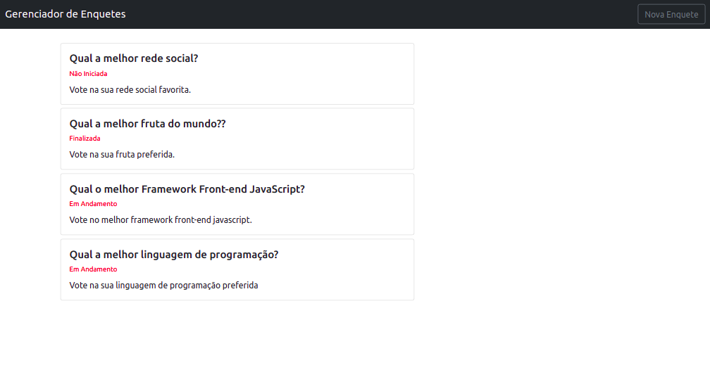
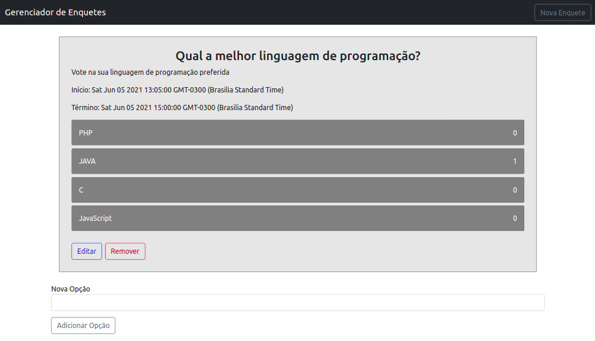

# Gerenciador de Enquetes

## Back-end

Api implementada em PHP/Laravel usando JSON e o padrão REST, com banco de dados em MySQl.

### Como Instalar

* Clone o repositório:

```
git clone https://github.com/IzaRam/poll-manager.git
```

* Na pasta raiz do projeto da API, execute o seguinte comando para instalar as dependências necessárias:

```
composer install
```

* Crie o arquivo de configuração de variáveis de ambiente:

```
cp .env.example .env
```

Configure as variáveis de ambiente e a conexão com o bando de dados no arquivo .env:

```
DB_CONNECTION=mysql
DB_HOST="HOST_NAME"
DB_PORT="PORT, DEFAULT=3306"
DB_DATABASE="DATABASE_NAME"
DB_USERNAME="YOUR_MYSQL_USERNAME"
DB_PASSWORD="YOUR_MEYSQL_PASSWORD"
```

* Execute o seguinte comando para gerar as tabelas no banco de dados:

```
php artisan migrate
```

* Execute para gerar uma nova key para a aplicação:

```
php artisan key:generate
```

* Execute o seguinte comando para iniciar o servidor:

```
php artisan serve
```

* Acesse no navegador: http://localhost:8000 ou a url que você tiver configurado.


### Instalar usando o Docker:

A API possuí um arquivo docker-compose.yml configurado, para instalar usando o docker basta executar o seguinte comando:

```
docker-compose up -d
```

Em seguida pode ser realizadas as mesmas configurações das intruções anteriores tanto no container do app, quanto no do banco de dados.


### Endpoints da API

```
GET /enquetes
GET /enquetes/{id}
POST /enquetes
PUT /enquetes/{id}
DELETE /enquetes/{id}

POST /enquetes/opcoes/{id}
POST /enquetes/opcoes/votar/{id}
```

### Modelos

```
{
    "id": 1,
    "titulo": "Qual a melhor fruta do mundo??",
    "descricao": "Vote na sua fruta preferida.",
    "inicio": "28-05-2021-16-00",
    "final": "28-05-2021-18-00",
    "created_at": "2021-05-28T19:37:25.000000Z",
    "updated_at": "2021-05-28T20:01:56.000000Z",
    "get_options": [
        {
            "id": 1,
            "enquete_id": 1,
            "titulo": "Abacaxi",
            "votos": 2,
            "created_at": "2021-05-28T19:37:25.000000Z",
            "updated_at": "2021-05-28T19:39:54.000000Z"
        },
        {
            "id": 2,
            "enquete_id": 1,
            "titulo": "Banana",
            "votos": 1,
            "created_at": "2021-05-28T19:37:25.000000Z",
            "updated_at": "2021-05-28T19:39:17.000000Z"
        },
        {
            "id": 3,
            "enquete_id": 1,
            "titulo": "Laranja",
            "votos": 4,
            "created_at": "2021-05-28T19:39:11.000000Z",
            "updated_at": "2021-05-28T20:03:00.000000Z"
        }
    ]
}
```

## Front-end

SPA implementado em Angular.

### Como Instalar

* Na pasta raiz do projeto do App, execute o seguinte comando para instalar as dependências necessárias:

```
npm install
```

* Execute o seguinte comando para iniciar o servidor da aplicação:

```
npm start
```

* Acesse no navegador a url: http://localhost:4200


### Instalar usando o Docker:

O app possuí um arquivo docker-compose.yml configurado, para instalar usando o docker basta executar o seguinte comando:

```
docker-compose up -d
```

Todas as configurações necessárias já estão feitas no docker-compose.yml, então basta acessar a aplicação no navegador na url:  http://localhost:4200


### App Overview







