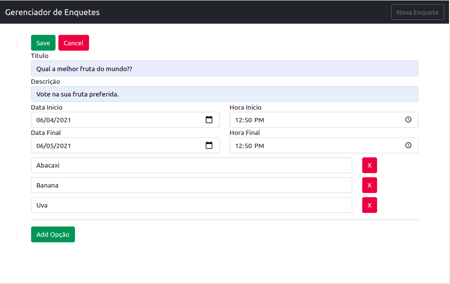
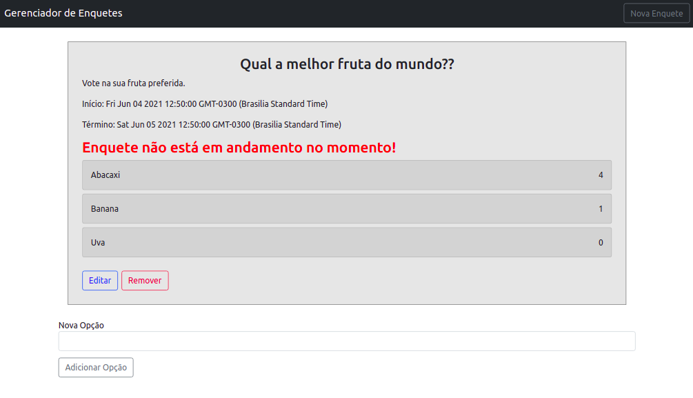

# Gerenciador de Enquetes

## Back-end

Api implementada em PHP/Laravel usando JSON e o padrão REST, com banco de dados em MySQl.

### Endpoints da API

```
GET /enquetes
GET /enquetes/{id}
POST /enquetes
PUT /enquetes/{id}
DELETE /enquetes/{id}

POST /enquetes/opcoes/{id}
POST /enquetes/opcoes/votar/{id}
```

### Modelos

```
{
    "id": 1,
    "titulo": "Qual a melhor fruta do mundo??",
    "descricao": "Vote na sua fruta preferida.",
    "inicio": "28-05-2021-16-00",
    "final": "28-05-2021-18-00",
    "created_at": "2021-05-28T19:37:25.000000Z",
    "updated_at": "2021-05-28T20:01:56.000000Z",
    "get_options": [
        {
            "id": 1,
            "enquete_id": 1,
            "titulo": "Abacaxi",
            "votos": 2,
            "created_at": "2021-05-28T19:37:25.000000Z",
            "updated_at": "2021-05-28T19:39:54.000000Z"
        },
        {
            "id": 2,
            "enquete_id": 1,
            "titulo": "Banana",
            "votos": 1,
            "created_at": "2021-05-28T19:37:25.000000Z",
            "updated_at": "2021-05-28T19:39:17.000000Z"
        },
        {
            "id": 3,
            "enquete_id": 1,
            "titulo": "Laranja",
            "votos": 4,
            "created_at": "2021-05-28T19:39:11.000000Z",
            "updated_at": "2021-05-28T20:03:00.000000Z"
        }
    ]
}
```

## Front-end

SPA implementado em Angular

### App Overview








